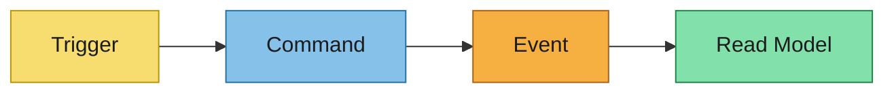
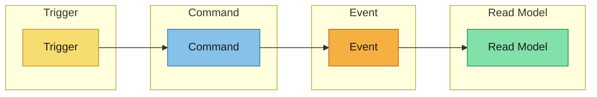

# Event Modeling

Convert event-storming outputs into explicit behavior flows.

Use this lane sequence for each scenario:
`Trigger -> Command -> Event -> Read Model`

## Scenario Overview
- Scenario:
- Business objective:
- Source references from `event-storming.md`:

## Swim Lanes

### Trigger
- Human/system trigger:
- Input signal:

### Command
- Command name:
- Target aggregate/context:
- Validation rules:

### Event
- Event name:
- Event payload summary:
- Ordering/idempotency notes:

### Read Model
- Projection or materialized view:
- Consumer(s):
- Query/use-case enabled:

## Mermaid Flow

## Timeline / Swimlane Diagram

## Derivation Notes for Downstream Artifacts
- Specs inputs (user stories and acceptance criteria):
- Design inputs (broker, subject naming, payload format, security):
- AsyncAPI inputs (channels, messages, bindings, schemas):
