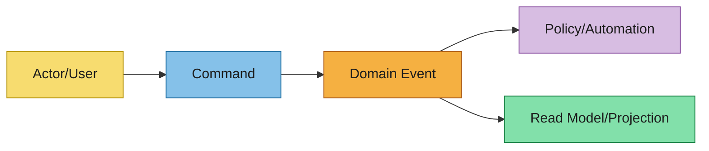

# Event Storming

Capture collaborative discovery outcomes for the domain before formal specs.

## Scope and Goal
- Domain/problem area:
- Desired business outcome:
- In/out of scope:

## Actors
- Primary users:
- External systems:
- Automated agents:

## Domain Events (Past Tense)
- Event:
  - Trigger/why it happened:
  - Data emitted:
  - Business impact:

## Commands
- Command:
  - Issuer (actor/system):
  - Aggregate/context target:
  - Preconditions:
  - Expected event(s):

## Aggregates / Bounded Contexts
- Aggregate/context:
  - Responsibilities:
  - Invariants:
  - Owned data:

## Automations / Policies
- Automation/policy name:
  - Triggering event:
  - Command emitted:
  - Failure handling:

## Timeline Diagram (Mermaid)

## Hotspots and Open Questions
- Ambiguity:
- Risk:
- Decision needed:

## Handoff to Next Artifacts
Summarize how these findings should inform:
- `event-modeling.md`
- `specs/**/*.md`
- `design.md`
- `asyncapi.yaml`
